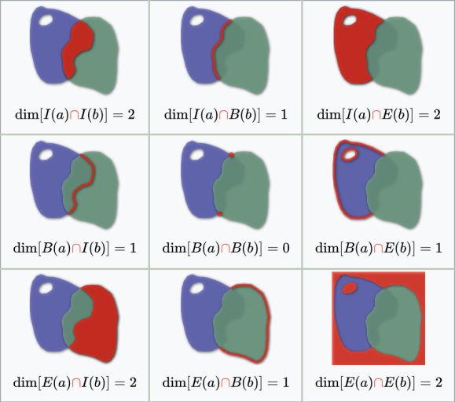

This little text below is from a reply I posted to [issue](https://github.com/Robinlovelace/geocompr/issues/699). I tried to help a bit and I learned a lot at the same time! 

The discussion topic was the `st_relate` function in the `sf` great package. this function implements the [Dimensionally Extended 9-Intersection Model (DE-9IM)](https://en.wikipedia.org/wiki/DE-9IM) [^1] or intersection matrix. 

> The intersection matrix is a 3 x 3 matrix that defines all possible pair-wise combinations of exterior, boundary and interior when two geometries interact. 

> The intersection matrix is the foundation of most geometric relationships supported by the OGC SQL/MM standard [...]. [^2]

[^1]: Egenhofer M. J., Herring J. R. (1995) Categorizing binary topoligical relationships between regions, lines, and points in geographic databases. Technical Report, Department of Surveying Engineering, University of Maine, Orono, ME.

[^2]: Hsu, L. S., Obe, R. (2021). PostGIS in Action, Third Edition. États-Unis: Manning. p269


Geometries can be polygons, lines and points. Polygons, two dimensional objects, are delimited by their boundaries (a line) and they can have an interior (an area) and an exterior (another area). Other geometries will mostly have lower dimensions in boundary and interior.

This is a nice representation from wikipedia: 




Here is the matrix of all of the possible options:

|          | Interior | Boundary | Exterior |
|----------|----------|----------|----------|
| Interior | 2        | 1        | 2        |
| Boundary | 1        | 0        | 1        |
| Exterior | 2        | 1        | 2        |

Each part of the matrix can get a value. The value is related to the dimensions of the returned object.

- 0 they intersect only on points (`st_dimension` return 0)
- 1 they intersect with lines (`st_dimension` return 1)
- 2 they intersect with an area (`st_dimension` return 2)
- T they intersect and the number of dimensions $>=$ 0 (ie all of the above)
- F No intersection
- \* it doesn't matter  

This flattened matrix will look like this: "212101212". This is called a **pattern**.

This matrix can be used in two ways: describe a relation between polygons or specify a type or relation you are interested in. As a result: you can use `st_relate` in two different ways:

- the first is to compute the DE-9IM relations between two objects
- the second is to check matching patterns

## Compute the DE-9IM relations between two objects

To have an easier time reading the pattern, let's make a quick function:

```{r}
pattern_de_9im =  "2FFF1FFF2"

matrix_de_9im = function(pattern) {
    string = unlist(strsplit(pattern , ""))
    matrix_de_9im = matrix(string, nrow = 3, byrow = TRUE)
    colnames(matrix_de_9im) = c("I", "B", "E")
    row.names(matrix_de_9im) = c("I", "B", "E")
    return(matrix_de_9im)
}

matrix_de_9im(pattern_de_9im)
```


I will enhance an example from the [sf documentation](https://r-spatial.github.io/sf/reference/st_relate.html).

```{r}
library(sf)
# 4 polygones to start 
pol1 = st_polygon(list(rbind(c(0,0),c(1,0),c(1,1),c(0,1),c(0,0)))) - 0.5
pol2 = pol1 + 1
pol3 = pol1 + 1.5
pol4 = st_polygon(list(rbind(c(-1,0.5),c(-1,1.5),c(0,1.5),c(0,0.5),c(-1,0.5))))

squares = sf::st_sf(data.frame(name = LETTERS[1:4],
           sf::st_sfc(pol1, pol2, pol3, pol4))
          )

plot(squares)
```

Here we can see how each square relates to the others:

```{r}
my_first_st_relate = sf::st_relate(squares, squares)
colnames(my_first_st_relate) = squares$name
row.names(my_first_st_relate) = squares$name
my_first_st_relate
```


We are producing a symmetrical matrix and you just need to focus on half of it. The first column describes how the A square is related to the other squares.

First line, first column [A,A] describes how the same square relates to itself:

```{r}
matrix_de_9im(my_first_st_relate["A","A"])
```

They share the same interior, same boundary and same exterior.

Let's see a more complicated case: square B with C:

```{r}
matrix_de_9im(my_first_st_relate["B","C"])
```

They share a part of their interior, their interior covers a part of their boundaries, a part of each interior is also an exterior of the other and their boundaries are related on two points.

Feel free to experiment with the other squares!

## Check matching patterns

Now that we are familiar with the pattern, we can search the matrix for particular patterns. The fact that patterns are just strings allows us to also use regular expressions or other string tricks. Here, for example, we can return every pair-wise relation that shares a boundary.

```{r}
# . represent every single character 
matrix(grepl(pattern = "....1....", my_first_st_relate),
       nrow = 4, byrow = TRUE) 
```

We can also translate spatial predicates with the DE-9IM pattern: see the Wikipedia page.

We can achieve the same result thanks to the pattern argument of the `st_relate` function. The syntax of the pattern changes a bit, you need to replace `.` (that means every single character) with `*` to match DE-9IM rules.

```{r}
sf::st_relate(squares, squares,  pattern = "****1****",  sparse = FALSE)
```

With `sparse = FALSE` it will return the matrix. If you change it to `TRUE` you get a a sparse geometry binary predicate in the form of a list (cf. chapter 4 of [Geocomputation with R](https://geocompr.robinlovelace.net/spatial-operations.html))

```{r}
sf::st_relate(squares, squares,  pattern = "****1****",  sparse = TRUE)
```


You can do a lot with this tool! My commentary on an issue lead Robin to write a nice [introduction to DE-9IM](https://geocompr.robinlovelace.net/spatial-operations.html#de-9im-strings). 

