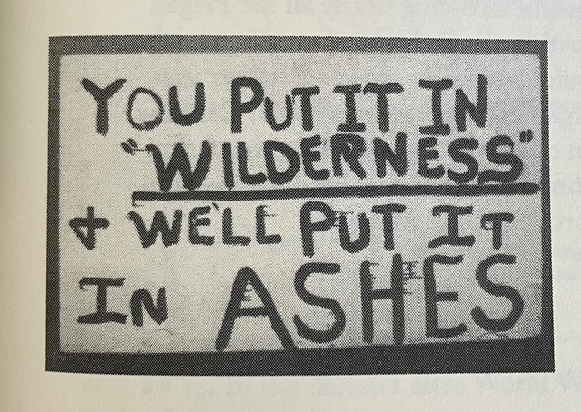

Since I’ve noticed that I mostly blog about data and computer topics, I thought it was time to balance things out a bit. 
Today, I want to highlight a passage from a book we’re reading at home: *[Blue Ridge Commons](https://www.ugapress.org/9780820341255/blue-ridge-commons/)* by **Kathryn Newfont**. 
It offers an interesting perspective on forests and data.

## Quick overview:

This won’t be a full-length book review, no time or plan for that but a bit of context: Blue Ridge Commons is a history book about [enclosures](https://en.wikipedia.org/wiki/Enclosure) and the many forms of contestation they sparked in Western North Carolina and the broader Appalachian region. 
It underscores how forests (broadly defined here) have historically been sites of overlapping human activities. 
Enclosures, whether old or more recent, tend to limit this plurality, often reducing forests to a single function or form of “production.” The book discusses this through examples like timber harvesting for paper mills via clearcutting, as well as policy frameworks like the Wilderness Act.

{fig-alt="Figure 11. The southern appalachian region proved a hotbed of antiwilderness activism during the RARE II process of the late 1970. Wilderness opponents used commons-friendly arguments to draw mountain residents to their cause, casting themselves as agents of commons defense and wilderness designation and wilderness designation as a form of enclosure. [...] The sign appeared in Georgia Chattahoochee National Forest, which bordered North Carolina Nantahala From Blue Ridge Commons. The Sign says You put it in  wilderness I will put in ashes"}

**Side note (from a French perspective):** French foresters might point out that the concept of *“multifonctionnalité”* is enshrined in French forest law[^2], though opinions likely vary on how it's applied in practice (as they should?).

## "Forest Management Becomes a Desk Job"

This quote, which is the title of a section in Chapter 9 (“Clearcutting Returns,” p. 237), stood out.

After noting that environmental legislation introduced in the late 1970s required significant paperwork, Newfont raises an interesting point about the rise of computer technology in forestry:

> Computer analysis had become a fact of Forest Service life by the late 1970s, as personnel routinely used computer models to strategize forest management. Such models physically removed foresters from the ground to the office. The language computer models used also distanced foresters from trees. One example suffices to illustrate the pattern. "Linear program systems," wrote one analyst in 1975, "will allow the planner to examine the effect of various decisions on the resource base (the forests) and the product output levels (e.g., timber, wildlife, and recreation)." This sentence transformed concrete specific entities [...] -- into abstract generalizations -- the resource base, products outputs. it encouraged planners to distance themselves mentally as well as physically from the immensely complicated material web of a forest. [p. 237]

While I’m not sure abstraction itself is the main force (a good abstraction should go back and forth) driving this “distancing,” I agree that, combined with the detachment from everyday on-the-ground activity (and more), it fosters overly simplistic management practices.

Later in the section, Newfont (through the voice of Bob Padgett, a recurring forester and source) notes that such “Linear Program Systems” encouraged even-aged management (think: one age group), as opposed to uneven-aged or all-aged management[^3]. The former is simply easier for the programs to handle. It doesn't require knowledge like “this makes a good picnic area,” or an attention to individual trees.

> "All a ranger of the future will need to do is punch his computer buttons to locate all stands of trees reaching age 80 that year, and schedule that timber for clearcutting," Padgett explained. In managing the woods by computer, forestry become a desk job.  

At that point, you might even ask: why do we need a forester at all? ([Fun link, pre-AI](https://terra0.org/)). A useful reminder that data and the models we build around it, are only one layer of a much more complex reality. 

If you are currently developing forest models, what are your thoughts on this?

[^2]: [https://www.legifrance.gouv.fr/codes/article_lc/LEGIARTI000043975426/2021-08-25](https://www.legifrance.gouv.fr/codes/article_lc/LEGIARTI000043975426/2021-08-25)

[^3]: futaie irrégulière ou jardinée et oui ce n'est pas exactement la même chose. 