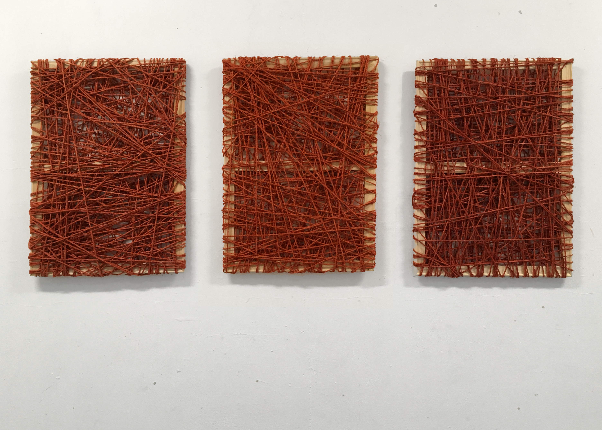

{fig-alt="three wooden frames wrapped with red ropes around each one of them on a white wall"}

I was watching [fedgeoday 2026](https://www.fedgeo.us/) when a speaker from one of my favorite and trusted data source in the US, the "US Census Bureau", introduced a change in their data infrastructure called "Frames". 
Everyone seems to be aware of it but not me! 

To bridge my lack of understanding I went to the US Census website and searched for Frames. 

On the section "What is a Frame" [^1] I got this sentence:

> The frames program defines "frame" as any foundational datasets that form the basis for much of the work we do at the Census Bureau. 

[^1]: <https://www.census.gov/about/what/transformation/maximizing-operational-efficiency/data-centric-business-ecosystem/frames-overview/frames.html> accessed 2026-06-01

If you are a bit lost, well you are not alone. 
Still it sounded like important.

After reading a list of some promised benefits to the program I was watched a short video (4 min ish) about it. 
The video is helpful; you have an address linked to a business linked to employees. 
I eventually got the message that the video was trying to convey but I was definitely lost my first time watching and felt it was a bit "dry", potentially cool but still dry.

Luckily this page also link to a [video](www.youtube.com/watch?v=
2NqU0FZJdDw) on the Youtube platform: one hour and forty minutes, four "likes" (one is mine, what are we doing if we are not "liking" US Census Bureau!!!) and 350 views at the time I watched it. 

Giving the relative obscurity of it and the attention span required (an hybrid of a zoom meeting and movie, a "zoovie" I guess) I tough it will be nice for myself and maybe other to provides an opinionated summary. 

# Frames, what?

## "Currently, an internal project"

The first and maybe more important part about "frames" is that it is "currently an internal use only project". 
If you only care of US Census External products you can stop reading and come back in few years. 


I was able to find a [timeline](https://www.gao.gov/products/gao-26-107689) of the project in the US Government Accountability Office (GAO). 

Instead, if you are thinking that it is important to understand how the data is actually produced: follow the guide. 

## Video plan and structure

This is a recording of a meeting with multiple speakers presenting slide decks (yeah fun!).
It can be divided in two parts. 
The first part introduces the Frame program and the frames within it. 
The second part introduces how can the program help US Census Bureau to produce new products or can by used by existing ones. It also shows some of early benchmarks. 
I will focus on the first part but may dabble for some other topics from the second part. 

# Frame, a summary

## At the core of a bigger "modernizing project"

Frames will be part of a bigger ecosystem that aim to "modernize the Census Bureau's statistical foundation."

They will be included in what the Census is calling their "Entreprise Data Lake (EDL)"[^datalake]. It seems fair to describe it like an organizational components where frames are being built and used. 

[^datalake]: So far it seems the term "Data Lake" does not relate to a specific architecture, more like an analogy where the census move from "ponds" (siloed data) to a "lake" (unified data) 
 
```{mermaid}
flowchart TD
    DICE[DICE] --> P
    I --> DICE
    subgraph EDL 
        P[Process and Planning] --> F[Frames]
        F <--> D[Other datasets]
        F --> I[Internal Products]
        D --> I
    end
    subgraph CEDSCI
        Ex[External Products]
    end
    I -->  Ex
```

I find it interesting that those 3 components have "entreprise"[^entreprise] in their names. 
In the same idea Frames in the EDL are called "Entreprise Frames". 
I am assuming this is to differentiate them with "Sampling frames" that also exist as "internal data". 
Like everyone in the video when I will referring to "frame" it will be for the "Entreprise Frame".

[^entreprise]: It seems a "Entreprise system" is a concept in government IT with the goal to mimic what is perceive to be done in corporate IT. I have not been able to find a clear reference on it. If you have one, please share!

Frames appears to be central in the EDL. 
They are partially producing from a team called DICE ("Data Ingest and Collection for Entreprise") and after being  processed, and fed internal products they will be used to generate external products. 

## Four Foundational Units

> A frame refers to a collection of datasets organized around one of four foundational units: Persons [**Demographic**[^note]], Business, Location and Job. 

[^note]: I am the one who add and link demographic to "Persons" here. 

They all have their own specific teams. 
Three of them seems to focus on enhancing existing datasets. 

+  MAF/TIGER[^loc] -> Location Frame

+  Business Register (BR) -> Business Frame
	
+  LEHD[^lehd] -> Job Frame

[^loc]: MAF stands for Master Address File and TIGER for Topologically Integrated Geographic Encoding and Referencing 

[^lehd]: LEHD stands for Longitudinal Employer-Household Dynamics 

The demographic Frame seems to be new and under construction but you could "smell" a lot of relations with US Census ACS (American Community Survey) and Census Decennial. 

A frame is not just datasets but also "a collection of standards, methods, codes, processes documentation and subject matter expertise". 
This seems obvious but it is worth repeating again and again: without all of that any data is nothing more than dead bits. 

At that point you may ask yourself is it just a renaming/rebranding exercice? 
First, if you know a bit about BR and LEHD you may knows that they are both including "administrative data" and it seems Frames are going more and more to rely on that kind of sources. 
Second it seems that the goal of the frames is to be linked together and being accessible in a common environment, the EDL. 

## Frames: linking datasets, breaking silos

It appears that a lot of Census Products were introduced progressively with various objectives and can be difficult to link. 
The Frames project aims to provide unique identifiers and keys that allow linking between frames. 

A location, an address, will be available for each person, job and business records. 
A person can be linked to jobs records.
Jobs records should be linked to business. 

```{mermaid}
flowchart TD
l[Locaction]
p[Person]
j[Job]
b[Business]
l <--> p
p <--> j 
l <--> j 
l <--> b 
b <--> j
```

While this make an easy diagram it is way harder to implement and present many questions.

First, even if it is an "internal projet only" it raises serious concern on data security and privacy. 
You are basically having a Residence Candidate File on steroids. 

Second, it seems that a frame should contains the whole universe of what they are trying to a represent, at least at one point in time.
For someone that used to count trees it seems that we are reversing the clock back from sampling to full surveys! 
How will we determine how confident we are on those metrics and how that will be communicated to the external products users? 

Third, it may sound too early but how these unique identifiers (ID) will handle change over time. 
It is important that an ID can link to other frames but it is equally important to be linked to past versions of itself.  Expanding on that how the frame will be linked to previous non-frame version of US Census products? 
In the example of, say an address change will it be linked to the previous "version" and how? 
The same questions, or variant of it, exist for job and business frames identifiers.  

## DICE (Data Ingest and Collection for the Enterprise)

I have to be careful here and avoid the topic of sources of data but, giving what was shared, it seems that processing and ingesting data will be shared between DICE and each frames team. 

The data will come from: 

- Administrative records

- Public records 

- Census / surveys

- Third parties 

There is not much information on what each of those categories may contains. The US Census bureau is pursuing some of what was started from the last ACS and is already discussed across other Census bureau around the world[^unece]. 

[^unece]: https://unece.org/statistics/publications/CensusAdminQuality

# Some Frames Spoilers!  

The video discussed some (potential?) features of each frame (and later how they will serve products). 
It is hard to say how they will be implemented and how they will percolate to externals products. 

## Geospatial Frame: 

It is definitely the one I am more interested and excited about. 
It will leverage both the MAF and TIGER multiple data sets;  supposedly enhancing them and providing better link between them. 

On the MAF front the goal is to introduce more categories for each address: instead of having them just labeled "Residential"and "Non Residential" they will be also labeled "Business" or "Mixed-use". 
A MAF identifier (MAFID) and geocodes (lat/long) will also be added.

The release of the MAF would also be more frequent. 

## Other Frames

For now I am less interested by them (albeit I recently used LEHD data a bit). 

The business frame mention includes a longitudinal business data and a better integration with the MAF. 

The job frame seems to cover and extend the LEHD. 
More Administrative data should help cover missing self-employment jobs. 
The LEHD is using the "Employer Characteristic File (ECF)" that could be replaced, and improved by the business frame. 
Similarly it is using a "Residence Candidate File" that also could be replaced by the geospatial frame.
I have took less notes on the demographic/person frames: it seems improvement will derive from integrating more administrative data, trend that was already started in recent ACS and decennial.


# Summary 

What seems to be matter (for now):  

- Mainly an Internal product! 

- A lot of the improvement seems to come from integrating and linking the frames. Overall, as a regular user of the US Census, that seems great.

- More use of administrative and third party data. Here I am mostly curious and will be happy to read what actual researchers will think about it!

I am still unsure how the frame are being build to handle drifting schema and how they will be used to revised (or not) or be linked with past products (or not)! 
